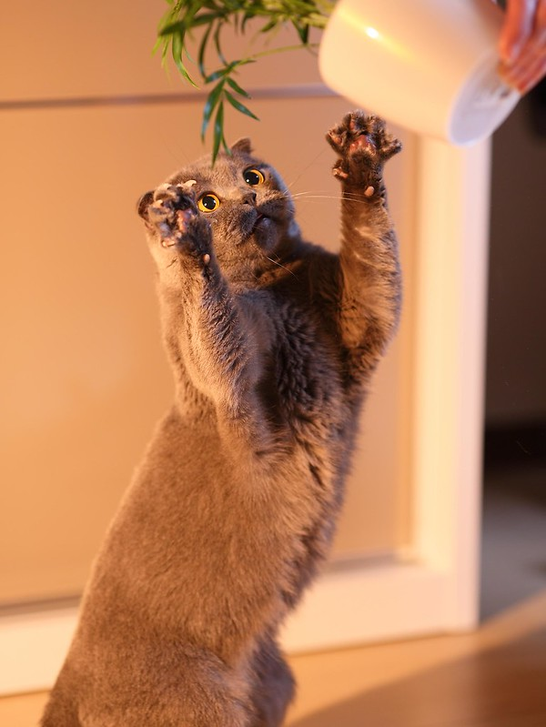
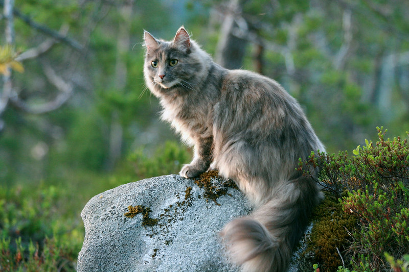

# My Favorite piece of Academic Work: *Does an internship count?*

The work I did during my summer 2021 internship was an amazing and eye-opening academic experience. It was almost entirely self-directed learning, and it was web-based design. I had no idea that I enjoyed this type of work, but it really merged my love of design with my love of history and storytelling. I was tasked with re-designing a website for a heritage project that connected historic sites with an online database of stories about that site's history via a QR code on nearby traffic boxes. I had no web design or user experience design background before tackling this project.

## Learning A New Industry Through Trial & Error

Thankfully my partner, who is an experienced UX researcher, helped me analyze the website and I facilitated the inspection and re-design of the website. I got to develop my quick learning skills further, and conducted the following protocols to improve the site:

+ Heuristics evaluation
+ Card sort
+ User testing (x2)
+ Re-doing the information architecture (IA)
+ Doing a content audit
+ Keeping a content inventory 

It's been an interesting journey, and I realized I am good at/enjoy some components of web design. Hopefully it can provide a career path as well.

My learning process can be briefly described using images of cats.

+ Here I am, stretching to investigate a new field. I'm intrigued but also terrified.

+ Ah, I've hit another snag in the design! Maybe if I go down the Google rabbit hole, I'll find the answer and get out of this box (until I inevitably get stuck again).

+ Now I am a majestic designer who is super comfortable in the tech & heritage design sectors. JUST KIDDING. My journey has just begun.

Thanks for reading! Check out the website I re-designed here: [capitalhistory](http://capitalhistory.ca)