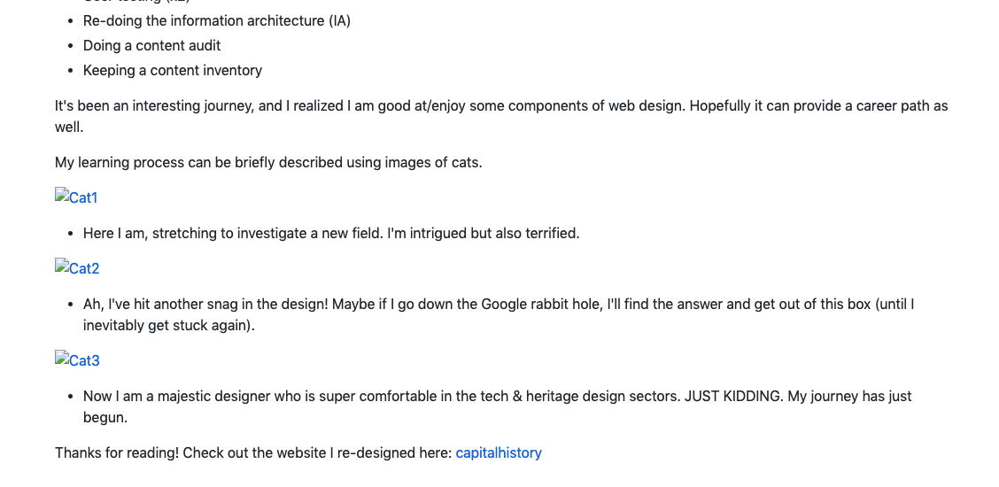

# what I was trying to do: 
## Reveal markdown conventions in my Github repo

The goal was to trying and use Markdown conventions on the text editor: Sublime text, and upload it to my GitHub repo. I really struggled with embedding images.

## how it might connect to other research I'm doing

I think Markdown could help me with digital storytelling and web design - I like that it's a syntax that isn't attached to any big word processing company like Adobe or Microsoft. It's a tool that has many applications.

## what I did

+ step 1  
	+ Downloaded Sublime Text, wrote blurb according to conventions, saved as text file in Markdown folder.
+ step 2
	+ Gathered images from [CreativeCommons](https://creativecommons.org/) to use in my blurb. Once embedded, I uploaded using Github web (not command line - I'm not there yet)
+ step 3
	+ Stared in horror at my broken image links after uploading the .md file to my Github repo. Back-pedaled, asked Dr. Graham for help, 

_drop images, screenshots as relevant into the vault, link to them here. Use backticks to copy in relevant code snippets etc

Screenshot of issues: #Markdownscreenshot

## challenges 

+ I dislike that Sublime doesn't have a "preview" option for viewing the Markdown changes (although I think this can be fixed with a plugin?) 

+ Issue 1: Sublime defaulted to saving in a text file, so figured out how to change the syntax to Markdown and ensure it saved in .md.
+ Issue 2: I thought I was supposed to save my images and .md ext in the same directory on my computer, and once I uploaded the .md file with the embedded image code I would see the images render in my Github repo. Not a chance. 
			+ I consulted with Dr. Graham and he showed me that I need to 

+ (Sidenote: OK so I didn't think to use Obsidian to do this Markdown, but it was much easier to do since it's set to produce Markdown extensions).

## thoughts on where to go next

*Hard lesson: Ask for help when using digital tools!!! It truly is a team sport. Data science is a humbling venture, and I think embracing this collective workflow will help me push back against the isolation often felt in academia*

### Borken Images: FIXED

**What went wrong?** *The images were broken because Github is a different computer server, so it can't communicate with mine easily if my photos reside on a non-Github directory.*
+ Ensure images in Github are in the same repo so Github can recognize the pathway. 
+ Another work-around is to use image address links for the embedding code (I think this is hard to do for your own images)

